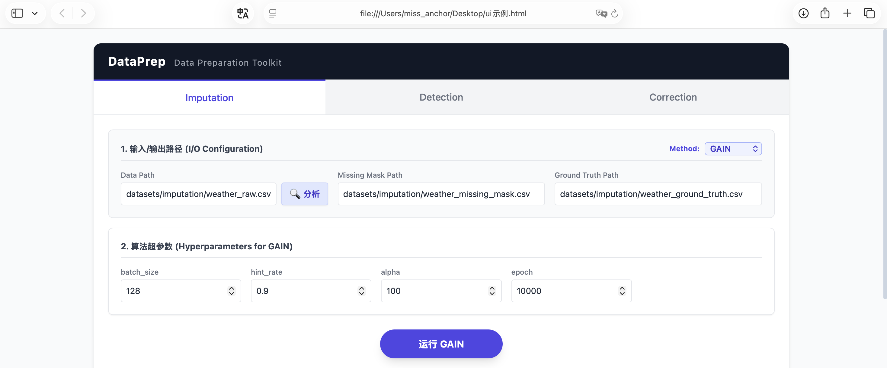
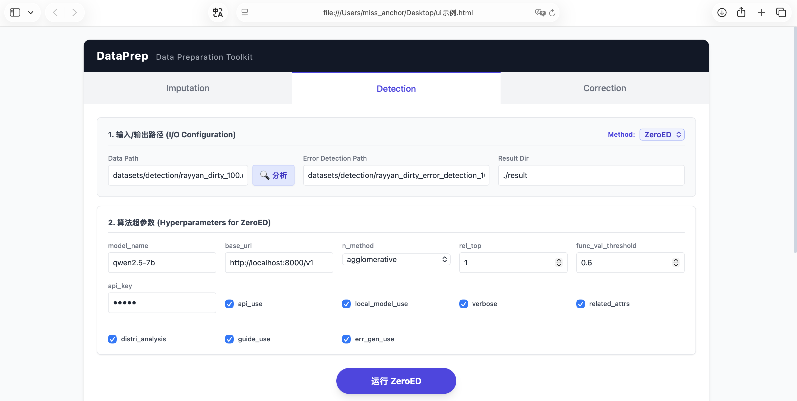
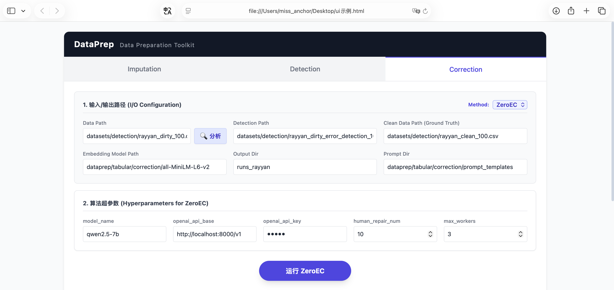
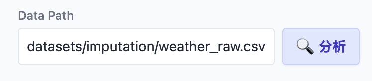
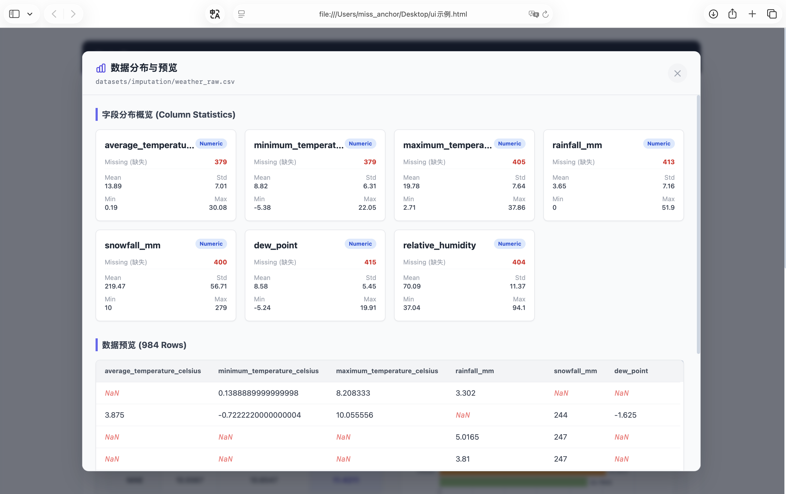

# 🚀 DataPrep Console User Manual

## 1. System Overview

**DataPrep Console** is an interactive data preparation and cleaning toolkit integrating advanced machine learning and deep learning algorithms. The system adopts a decoupled frontend-backend architecture (Vue 3 + FastAPI) and provides a visual interface covering three core data governance scenarios: **Imputation**, **Detection**, and **Correction**.

The system has built-in cutting-edge algorithms based on deep learning and Large Language Models (LLMs) such as GAIN, VAEGAIN, SCIS, ZeroED, and ZeroEC. It also integrates classic Sklearn baseline algorithms, supporting end-to-end data preprocessing, real-time progress monitoring, rigorous multi-dimensional metric evaluation, and result export.

---

## 2. Core Functional Modules

The system is divided into three core workspaces via the top navigation bar, with each workspace targeting specific data quality issues:

### 2.1 Missing Value Imputation
Performs high-precision imputation for missing values in large-scale tabular data.
* **Supported Algorithms**:
    * **Ours**: `GAIN`, `VAEGAIN`, `SCIS`
    * **Baselines**: `BayesianRidge`, `Random Forest`
* **Required Input Paths**:
    * `Data Path`: The original dataset containing missing values.
    * `Missing Mask Path`: The indicator matrix for missing positions (0 for missing, 1 for observed).
    * `Ground Truth Path`: The complete, clean dataset used to evaluate imputation performance.
* **Evaluation Metrics**: RMSE (Root Mean Square Error), MAE (Mean Absolute Error).
* Note: You can click the `Method` to change the algorithm
  
  
### 2.2 Error/Anomaly Detection
Automatically locates potential dirty data or erroneous cells within large-scale tables.
* **Supported Algorithms**:
    * **Ours**: `ZeroED`
    * **Baselines**: `LOF`, `Isolation Forest`
* **Required Input Paths**:
    * `Data Path`: The original dataset containing dirty data.
    * `Error Detection Path`: The true error location mask (Ground Truth, used to calculate evaluation metrics).
* **Evaluation Metrics**: Precision, Recall, F1-Score.

  

### 2.3 Data Correction
Repairs dirty data into correct data given the completely true error locations (Ground Truth Error Mask).
* **Supported Algorithms**:
    * **Ours**: `ZeroEC` (LLM-based intelligent data repair)
    * **Baselines**: `Mode`, `KNN`
* **Required Input Paths**:
    * `Data Path`: The dirty dataset.
    * `Detection Path`: The error location mask matrix.
    * `Clean Data Path`: The clean ground truth dataset (used to calculate evaluation metrics).
    * `Embedding Model Path` & `Prompt Dir`: Dependency paths for the language model and prompt templates.
* **Evaluation Metrics**: Precision, Recall, F1-Score.

  

---

## 3. Interface Interaction and Operation Guide

### 3.1 Data Profiling and Preview
After entering the data path, click the **"🔍 Analyze"** button, and the system will call the backend API for data exploration:
  <p style="margin-left: 20px; margin-right: 50px;">
  </p>

* **Field Statistics Overview**: Automatically identifies numerical and categorical fields, calculating the number of missing values, mean, standard deviation, extreme values, and the number of unique values.
* **Dynamic Data Preview**: Provides a scrolling preview of up to the **Top 1000 rows** of the raw data. Missing values (`NaN`) are automatically highlighted in red and italicized.
  
  

### 3.2 Dynamic Hyperparameter Configuration
When selecting different algorithms, the console automatically renders the corresponding hyperparameter input form.
* Supports numerical and text inputs, as well as boolean (Checkbox) toggles.
* For example, in `ZeroEC`, you can directly configure parameters like the LLM API Key and the number of concurrent threads (`max_workers`).

  

### 3.3 Real-time Logs and Progress Monitoring
After clicking Run, the system establishes a persistent connection via WebSocket:
* **Progress Bar Display**: Provides a visual Epoch/Step progress bar for long-running deep learning training tasks.
* **Loss Monitoring**: Parses and displays training metrics like `G_Loss`(Generator loss, measuring how realistic the imputed data is), `D_Loss`(Discriminator loss, measuring the ability to distinguish real vs. generated data), and `MSE` in real-time.
* **Console Output**: Fully captures the backend's `stdout` and `stderr`, providing highlighted color prompts upon execution completion or when exceptions are thrown.
  
  

### 3.4 Evaluation Dashboard and Result Export
After a task executes successfully, the results panel will automatically slide out at the bottom of the page:
* **Multi-dimensional Metric Comparison Table**: Intuitively compares the performance differences between the current algorithm and traditional baseline algorithms.
* **ECharts Bar Chart**: Supports responsive, interactive performance comparison visualizations.
* **Processed Data Preview**: Displays the data after algorithm processing (up to 1000 rows). **Cells that the algorithm actually imputed, detected as errors, or corrected will be highlighted in red.**
* **One-Click Download**: Click the "Download" button to export and save the corrected dataset or Error Mask (where `True` indicates a cell detected as an error, and `False` indicates a correct cell) as a local CSV file.

  
---

## 4. Local Startup Guide

### 4.1 Environmental Dependencies
Ensure you have installed the Dataprep environment and the following core dependencies:
```bash
pip install fastapi uvicorn 
```

### 4.2 Start Backend Service
In the project root directory, run the following command to start the FastAPI WebSocket service:
```bash
uvicorn main:app --host 127.0.0.1 --port 8088 --reload
```

### 4.3 Start Backend Service
Since the backend is running on **127.0.0.1:8088** on the server, you need to forward this port to your local machine (e.g., your local Mac) to allow the frontend to communicate with it.

Open a new terminal on your local machine and run the following SSH command:
```bash
ssh -L 8088:127.0.0.1:8088 your_username@your_server_ip
```

### 4.4 Access Frontend Console
Directly double-click the index.html file on your local machine to open it in your browser. The DataPrep Console will seamlessly connect to your server's backend!